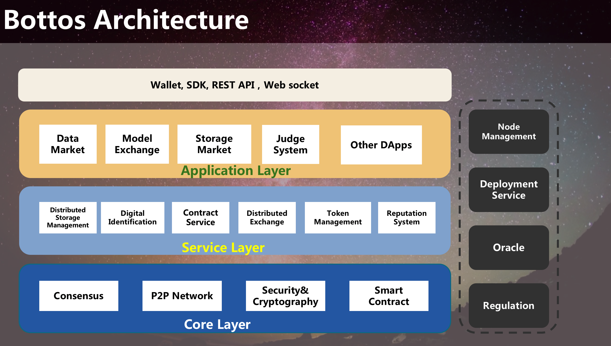

# Bottos blockchain

[](https://goreportcard.com/report/github.com/bottos-project/bottos)   [](https://opensource.org/licenses/GPL-3.0)

Bottos is building the infrastructure for AI development through blockchain technology in order to create a new decentralized AI ecosystem.

Bottos blockchain architecture is shown below.


## Deveplopers Forum

https://gitter.im/bottos-project/bottos

## Develop Doc
https://www.bottos.org 


## Features of Bottos chain
On Bottos blockchain, you have the newly designed basic blockchain services

-  **Hybrid Consensus**
-  **High-Performance Transactions**
-  **Microservices Chain Core**
-  **Horizontally Scalable Node (Cluster Nodes)**
-  **One-Click Deployment Script**
-  **Dynamic Node Model**
-  **Multi-Value System**
-  **Smart Contracts Domain**


And you also have multiple services below which are dedicated designed for AI ecosystem

-  **Multi-Data Service**
-  **Adaptive Distributed Storage**
-  **Distributed Digital Identification**
-  **Hierarchical Qos Service**
-  **Agile DApps Deployment**
-  **Contracts Management Service**

Following the instructions below, you can build and deploy your own test node.

## One-Click Deploy a Bottos Node

[One-Click Deployment Script](https://github.com/bottos-project/magiccube/tree/master/service/node/scripts/startup.sh)

- **Install**: Login as root, and execute *./startup.sh deploy*
- **Update source code**: Create user bottos and switch to bottos, and execute *./startup.sh update*
- **Run**: Execute *./startup.sh buildstart* to build the source code and run bottos chain
- **Stop**: Execute *start  / stop* to stop  

## Deploy a Bottos Node Manually

   To build a Bottos single node environment originally, following steps need to be done.
*	Precondition
        Root account should be available in order to install all the required packages.
    User account [ bottos ] should be pre-created in order to apply the Bottos node.
*	Install basic packages and modules
    All required packages will be installed through this step.

```
Packages to be installed include:
    Golang
    git
    jq
    libssl
    curl
    gcc
```

### Installation commands
```
    apt-get update
    apt-get install gcc
    apt-get install curl
    apt-get install git
    apt-get install jq
    apt-get install pkg-config libssl-dev libsasl2-dev
    apt-get install linuxbrew-wrapper

    brew install consul

    cp consul /home/bottos/opt/go/bin

    brew install protobuf
    cd /home/bottos/opt/go/bin;

    go get -u github.com/golang/protobuf/proto
    go get -u github.com/protoc-gen-go
    go get -u github.com/micro/protoc-gen-micro

    go get -u github.com/micro/micro

    curl –O https://dl.minio.io/server/minio/release/linux-amd64/minio /usr/local/bin/

    chmod a+x /usr/local/bin/minio

    useradd -r minio-user -s /sbin/nologin

    chown minio-user:minio-user /usr/local/bin/minio -R

    mkdir /usr/local/share/minio

    chown minio-user minio-user /usr/local/share/minio -R

    mkdir /etc/minio

    chown minio-user minio-user /etc/minio –R

    rm -rf /etc/default/minio

    echo "MINIO_OPTS=\"-C "$MINIO_COF" --address "10.10.10.189":"9000"\"" >> /etc/default/minio

    echo "MINIO_OPTS=\"-C "$MINIO_COF" --address "10.10.10.189":"9000"\"" >> /etc/default/minio

    source /etc/default/minio

    curl -O https://raw.githubusercontent.com/minio/minio-service/master/linux-systemd/minio.service

    cp minio.service /etc/systemd/system

    systemctl daemon-reload
    systemctl enable minio

    ufw allow 9000
    systemctl restart ufw

    wget https://storage.googleapis.com/golang/go1.10.1.linux-amd64.tar.gz --directory-prefix=/home/bottos
    tar -xzvf /home/bottos/go1.10.1.linux-amd64.tar.gz -C /usr/local
    tar -xzvf /home/bottos/go1.10.1.linux-amd64.tar.gz -C /usr/lib
```

#### Golang’s system environment variable setting

Write down following syntax into file /home/bottos/.bashrc.

      export GOPATH="/mnt/bottos"
      export GOROOT="/usr/lib/go"

Then, do “source /home/bottos/.bashrc” to activate the setting.

Check whether command “go” take effect after your setting.

**NOTE**
```
Login system as root is a MUST during this step to avoid no enough permissions during installing basic packages.

After basic packages are installed, you can download the bottos codes from github and build / run the bottos services later.

Please replace the address “10.10.10.189” by your external IP address. The external IP address can be found via command [ ifconfig ]
```

&nbsp;

### Download Bottos codes
From this step on, user can choose to login system either as root or bottos account to do codes’ downloading or run services then.

For the safety reason, we suggest user to use [ bottos ] account to continue following steps .

#### Download code commands
```
    mkdir –p /home/bottos/mnt/bottos/src/github.com/bottos-project

    git clone https://github.com/bottos-project/magiccube.git /home/bottos/mnt/bottos/src/github.com/bottos-project/magiccube

    cd /home/bottos/mnt/bottos/src/github.com/bottos-project/ magiccube/service/node/keystore

    git clone https://github.com/bottos-project/crypto-go.git

    git clone https://github.com/bottos-project/bottos.git /home/bottos/mnt/bottos/src/github.com/bottos-project/bottos
```

&nbsp;

### Bottos Services Configuration
The Bottos configuration includes node configuration, chain configuration and genesis configuration.
The node configuration file [config.json] describes all the service names that supported by this node, and service file stored path, service IP address, etc.
The configuration file [chainconfig.json] and [genesis.json]  describe the essential parameters to initializing the blockchain.

#### Generate config.json file
Create the file named as config.json and put the file onto directory /home/bottos/opt/go/bin.
The sample contents of files are shown as following.

Sample for config.json
```
        {
        "node": [
            {
            "nodeName":    "node1",
            "ipAddr":"10.10.10.189",
            "userName":    "",
            "passWord":    "",
            "btoPort":    "",
            "btoUser":     "",
            "prodUser":    "",
            "btoPath":     "/home/bto",
            "walletIP":     "10.10.10.189",
            "keyPath":     "/home/bto",
            "dbUser":      "",
            "dbPass":      "",
            "storageSize": "1T",
            "storagePath": "/media",
            "servPath":    "/home/bottos/opt/go/bin",
            "servLst": [
                "storage",
                "ideApi",
                "identity",
                "reqApi",
                "requirement",
                "assApi",
                "asset",
                "excApi",
                "exchange",
                "dasApi",
                "dashboard"
            ]
            }
        ]
        }
```
**NOTE**
Fill your system external IP address according to sample case and others keep same as the sample.
	The external IP address can be found via command [ ifconfig ]
For the empty items, we aims to extend the usages in future.

&nbsp;

### Prepare chainconfig.json and genesis.json
The chainconfig.json and genesis.json files are the essential parts of block chain, they are at code directory of /home/bottos/src/github.com/bottos-project/bottos.
Please copy the two json files onto /home/bottos/opt/go/bin:
```
    cp   /home/bottos/mnt/bottos/src/github.com/bottos-project/bottos/ chainconfig.json  /home/bottos/opt/go/bin

    cp   /home/bottos/mnt/bottos/src/github.com/bottos-project/bottos/ genesis.json  /home/bottos/opt/go/bin
```

&nbsp;

### Build Codes & Start All Services
#### Build services

All codes will be built and all services will be brought up through this step.
Following operations can be done in this procedure after user build and run all the services.
```
    Generate node’s keystore file [ /home/bto/bto.keystore ] (if file does not exist).
    Bring up all the services according to node’s configuration file [ /home/bottos/opt/go/bin/config.json ].
    Create [ bottos ] account and deploy bottos’ contract on Bottos Chain.
```

#### Commands

        cp /home/bottos/mnt/bottos/src/github.com/bottos-project/magiccube/vendor/* /home/bottos/opt/go/bin
        cd /home/bottos/opt/go/bin
        go build github.com/bottos-project/magiccube/service/node
        go build github.com/bottos-project/magiccube/service/storage
        go build github.com/bottos-project/magiccube/service/ideApi
        go build github.com/bottos-project/magiccube/service/identity
        go build github.com/bottos-project/magiccube/service/reqApi
        go build github.com/bottos-project/magiccube/service/requirement
        go build github.com/bottos-project/magiccube/service/assApi
        go build github.com/bottos-project/magiccube/service/asset
        go build github.com/bottos-project/magiccube/service/excApi
        go build github.com/bottos-project/magiccube/service/exchange
        go build github.com/bottos-project/magiccube/service/dasApi
        go build github.com/bottos-project/magiccube/service/dashboard
        go build github.com/bottos-project/bottos/bcli

**NOTE**
This command only needs try once when a node is original be built to start.
```
    cp /home/bottos/mnt/bottos/src/github.com/bottos-project/magiccube/vendor/* /home/bottos/opt/go/bin
```

User can choose to login system either as root or bottos during this step, no other users are allowed (to avoid no permissions).
Repetitive execution of this step is also supported. The script always stop all services by first, then bring up them one by one again.

&nbsp;

### Start all services
Commands list
```
    cd /home/bottos/opt/go/bin
    consul agent -dev &
    micro api &
    systemctl start minio
    minio server -C /etc/minio --address "10.10.10.189:9000" &
    ./node &

    cp /home/bottos/mnt/bottos/src/github.com/bottos-project/bottos/bcli/bcli /home/bottos/opt/go/bin/core/cmd_dir

```

**NOTE**
    The node program will bring all the services in “servLst” that configured in config.json.
    
## License
GPLv3 licensed.

